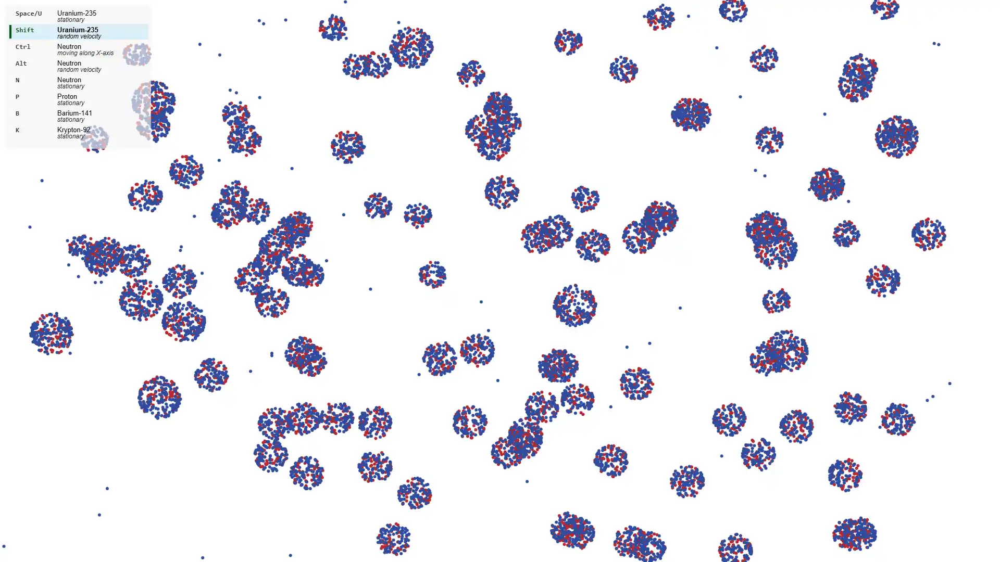

# nuclear-fission-simulation

interactive nuclear fission simulation using pure html and js  

## (PL) Instrukcja:
Kliknij lewym przyskiem myszki, aby stworzyć w miejscu kursora obiekt zgodny z aktualnym trybem.

Tryb domyślny: Uran-235

Zmiana trybów:
- Spacja lub U - Nieruchomy Uran-235
- Lewy Shift - Uran-235 z losowo nadaną prędkością
- Lewy Control - neutron poruszjący się zgodnie z osią X
- Lewy Alt - neutron z losowo nadaną prędkością
- N - Nieruchomy neutron
- P - Nieruchomy proton
- B - Nieruchomy Bar-141
- K - Nieruchomy Krypton-92

## (EN) Manual:
Click the left mouse button to create an object at the cursor location that matches the current mode.

Default mode: Uranium-235

Changing modes:
- Space bar or U - stationary Uran-235
- Left Shift - Uran-235 with randomly assigned speed
- Left Control - neutron moving along the X axis
- Left Alt - neutron with randomly assigned speed
- N - stationary neutron
- P - stationary proton
- B - stationary Bar-141
- K - stationary Krypton-92
